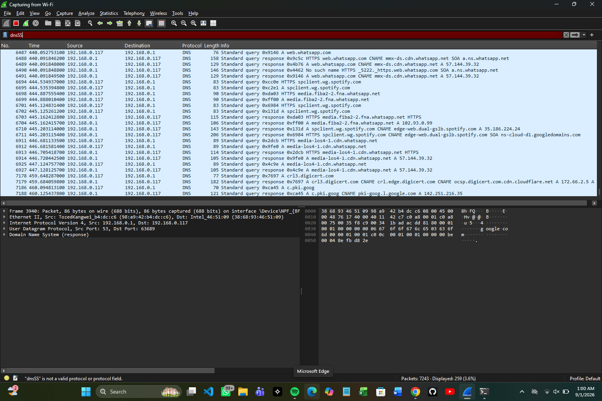
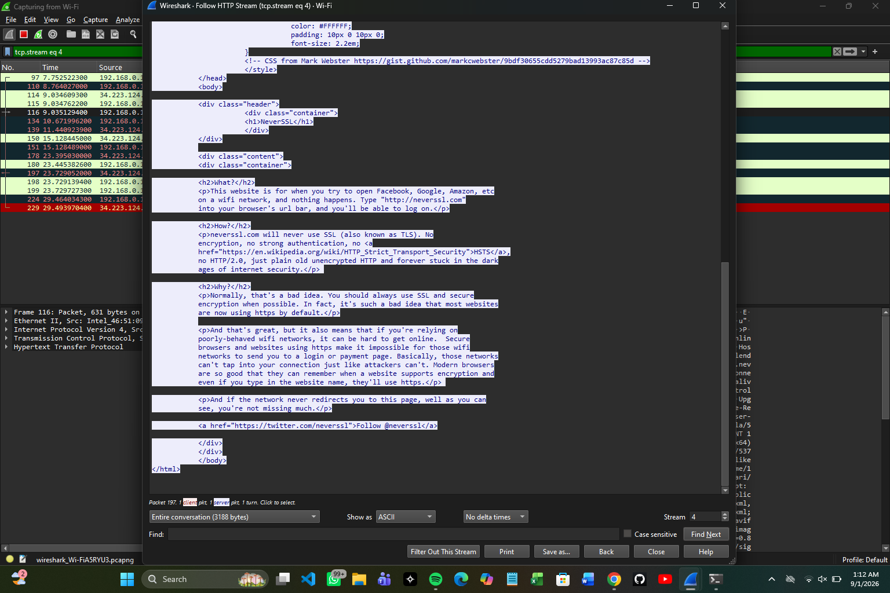
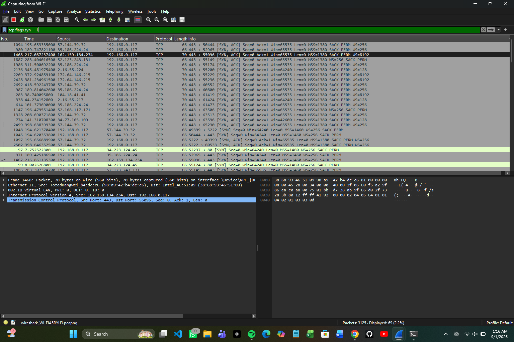

# packet-analysis-lab-01
# Wireshark Packet Analysis — Home Network Traffic

## Objective
Hands-on project to build foundational packet analysis skills using Wireshark, 
as part of my SOC analyst preparation. Captured and analyzed my own home network 
traffic to understand DNS resolution, HTTP communication, and the TCP handshake.

## Tools Used
- Wireshark
- Home network (Wi-Fi capture)

## Steps & Findings

### 1. DNS Query Analysis
Filtered traffic using `dns` to observe domain resolution.

**Sample finding:** DNS server (192.168.0.1) resolved `spclient.wg.spotify.com` 
via a CNAME chain to `edge-web.dual-gslb.spotify.com`. Assessed as benign — 
legitimate Spotify infrastructure, expected resolver, no anomalies.

### 2. HTTP Stream Reconstruction
Used Follow > HTTP Stream on a plaintext HTTP request to neverssl.com to see 
how unencrypted traffic exposes full page content.

**Key takeaway:** HTTP traffic is fully readable by anyone capturing packets — 
demonstrates why HTTPS/TLS matters for anything sensitive.

### 3. TCP 3-Way Handshake
Filtered using `tcp.flags.syn==1` to identify the SYN, SYN-ACK, ACK sequence 
establishing a TCP connection.

## Skills Demonstrated
- Wireshark display filters (`dns`, `http`, `tcp.flags.syn==1`)
- Packet-level protocol analysis (DNS, HTTP, TCP)
- Traffic triage and benign/malicious assessment reasoning
- Basic incident documentation format

## Next Steps
- Analyze a known-malicious pcap sample (TryHackMe / malware-traffic-analysis.net)
- Move on to TryHackMe SOC Level 1 path
